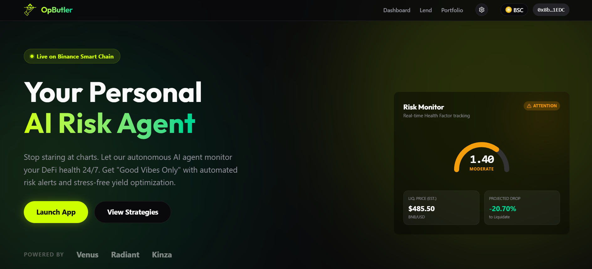
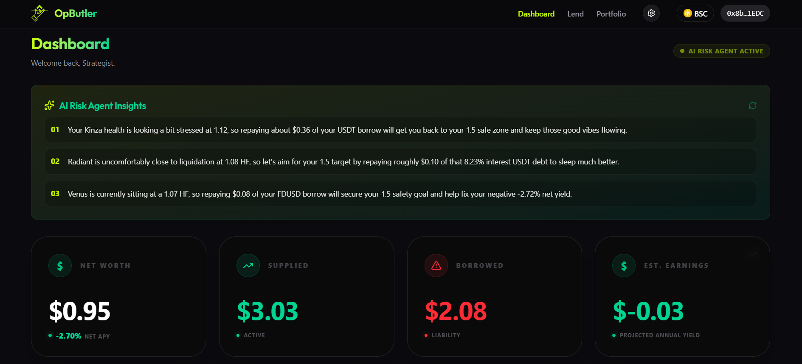
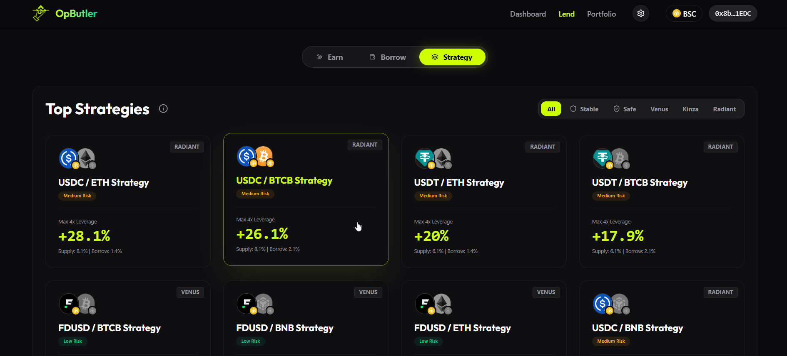

# OpButler - Your Personal Agentic DeFi Concierge

> **The easiest way to manage and grow your DeFi positions on BNB Chain from one unified interface. Powered by Gemini, watching your back 24/7 and executing your strategies on-chain.**

[](https://opbutler.xyz)
[](https://t.me/OpButlerBot)



## 🤖 Agentic Blockchain 24/7 Watch
Our core differentiator is the **Autonomous AI Risk Agent**. 
- **Continuous Monitoring**: Scans user positions across Venus, Kinza, and Radiant every block (using a similar polling approach to **OpenClaw**).
- **Gemini-Powered Synthesis**: Translates complex on-chain metrics into actionable, natural-language risk assessments.
- **Proactive Mitigation**: Sends instant Telegram alerts with specific instructions (e.g., *"Repay 2.5 BNB"*).

## 📦 Integrated Application & Execution
OpButler is not just an agent; it is a full-stack DeFi powerhouse backed by verified smart contracts.
- **Yield Dashboards**: A "God Mode" interface aggregating Venus, Kinza, and Radiant.
- **Strategy Builder**: Architect complex loop strategies with real-time simulation.
- **Executor**: Atomic, trustless execution of strategies via the `OpLoopVault` contract.

## 🚀 Key Features

### 📊 Yield Dashboard with AI Risk Guard
**Unified Portfolio Management**
Manage your positions across Venus, Kinza, and Radiant from a single, high-fidelity interface. Monitor Net Worth, Net APY, and Health Factors in real-time.



### 🤖 AI Risk Agent
**24/7 Agentic Guardian**
Our Gemini-powered watchdog synthesizes on-chain metrics into natural language risk audits. Get instant Telegram alerts for liquidation risks and proactive strategy suggestions.


### ⚡ Strategy Executor (Smart Loops)
**Risk-Aware Architect**
Model complex "Smart Loop" strategies and **execute them on-chain** via our verified `OpLoopVault` contract on BSC.



### 🔗 Smart Contracts
**Verified Execution Layer**
Trustless, atomic execution of leverage and deleverage loops.
- **Contract**: `OpLoopVaultV3`
- **Address**: [`0x0C0D77F03d98Be4e4E1FA7be0591ec3bEcF14f03`](https://bscscan.com/address/0x0C0D77F03d98Be4e4E1FA7be0591ec3bEcF14f03)
- **Tx Hash**: [`0xb58369c356595f1b35606517ebfce456fd888fe45c23f658288eb8f09762a8b1`](https://bscscan.com/tx/0xb58369c356595f1b35606517ebfce456fd888fe45c23f658288eb8f09762a8b1)
- **Tx Hash**: [`0x6cf6613ee1c16af657e18b6ea67c84f3a002fa816c8a4b18251ab9fd0db445cf`](https://bscscan.com/tx/0x6cf6613ee1c16af657e18b6ea67c84f3a002fa816c8a4b18251ab9fd0db445cf)

---

## 📂 Repository Layout

```text
/README.md             ← Concierge Overview & Quick Start
/docs/
  PROJECT.md           ← Problem, Solution, HITL-to-Autonomous Roadmap
  TECHNICAL.md         ← Architecture, Setup, Verification Guide
  EXTRAS.md            ← Presentation Slides & Demo Video
/src/
  frontend/            ← Next.js Web Dashboard
  telegramagent/       ← AI Agent Logic & Backend
  contracts/           ← Solidity Smart Contracts (OpLoopVault)
  supabase/            ← Consolidated Database Migrations
```

## 🛠️ Reproduction Quick Start

### 1. Database Setup
See **[Database Setup Guide](./src/supabase/README.md)**. Run the consolidated SQL migrations in your Supabase project.

### 2. AI Agent (The Watchdog)
Navigate to `src/telegramagent`, setup secrets, and launch.
```bash
cd src/telegramagent
cp .env.example .env  # Fill in your keys
npm install
npm start
```

### 3. Frontend Dashboard
Navigate to `src/frontend` and start the UI.
```bash
cd src/frontend
cp .env.example .env.local  # Optional: Configure custom RPCs
npm install
npm run dev
```

### 4. Smart Contract (Execution Layer)
OpButler is pre-wired to our **verified OpLoopVault** on BSC Mainnet (`0x0C0D...`).
- **Default**: No action required. Use our public execution layer.
- **Custom Deployment**: To deploy your own vault, see **[Contracts Guide](./src/contracts/README.md)** and update `src/frontend/lib/pool-config.ts`.

---

## 📈 Impact & Vision
OpButler triggers a paradigm shift from "User-Initiated" to **"Agent-Initiated"** DeFi. We combine **Gemini's semantic reasoning** with **verified on-chain execution vaults** to create a true concierge experience: the AI monitors the chain 24/7 and drafts complex **Smart Loop transactions** for you, bridging the gap between passive holding and algorithmic yield farming.