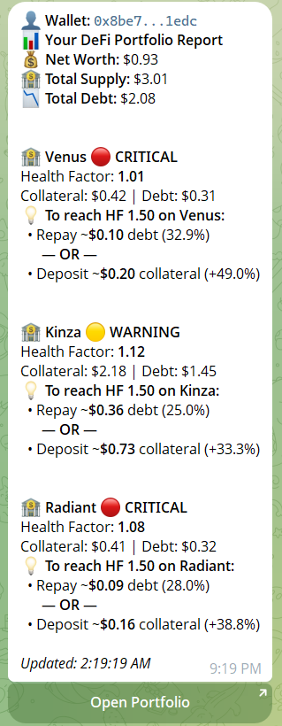
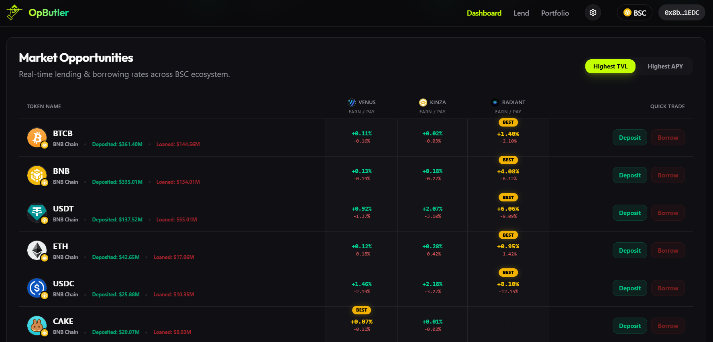

# Project Overview

## ❓ The Problem: Fragmented DeFi stress

Managing high-yield positions on BNB Chain is currently a fragmented, high-stress experience.
-   **Cognitive Load**: Users must manually monitor diverse metrics (Net APY, HF, LTV) across multiple protocols.
-   **Liquidation Latency**: Volatile market conditions can result in sudden liquidations before a user can manually react.
-   **Execution Complexity**: Advanced "Smart Loop" strategies are inaccessible to average users due to the complexity of the supply-borrow-supply cycle.

---

## 💡 The Solution: OpButler

OpButler acts as an **Agentic Portfolio Concierge**. It synthesizes cross-protocol data into a high-fidelity "God Mode" dashboard and deploys an autonomous watchdog for every user.

### Unified Dashboard (God Mode)

A premium interface that aggregates **Venus, Kinza, and Radiant** into a single net-worth snapshot, replacing the need for 5+ browser tabs.

### AI Risk Guard (Semantic Synthesis)

Uses **Gemini 1.5 Flash** to provide natural-language risk assessments. It doesn't just show numbers; it explains *why* you are safe or at risk.

### Strategy Discovery & Execution

The Agent proactively scans for "Market Opportunities" and high-yield loops. Users can view these opportunities and execute them atomically via the **OpLoopVault**.

---

## 🌍 Impact: democratizing "Safe" Yield
OpButler facilitates deeper liquidity on BNB Chain by removing the "Bad Vibes" of manual risk management. We transform DeFi into a set-and-forget experience for the retail user.

---

## 🗺️ Roadmap: The Path to Superintelligence

### Phase 1: Agent-Initiated Autonomy [LIVE]
- **Status**: **Active Mainnet Deployment**.
- **Mechanism**: The Agent operates as a **24/7 autonomous watchdog**, monitoring 3+ protocols and computing complex risk scenarios off-chain. It actively **constructs and proposes** high-fidelity execution payloads (Smart Loops). The user serves as the final "Security Keymaster," signing the optimized transactions prepared by the AI. This ensures maximum security while offloading 99% of the cognitive labor to the Agent.

### Phase 2: Trustless Delegated Execution
- **Goal**: Non-Custodial "Session Key" Automation.
- **Mechanism**: Upgrading the `OpLoopVault` to support **Restricted Session Keys**. This allows the Agent to autonomously execute *specific* safety actions (e.g., "Panic Repay" or "Yield Migration") within strict, user-defined boundaries without requiring a real-time signature.
- **Technology**: Integration with **OpenClaw** for verifiable, proof-backed agent actions.

### Phase 3: Cross-Chain Hivemind
- **Goal**: Multi-Chain Liquidity Arbitrage.
- **Mechanism**: Expanding the Agent's context window to the entire BNB Ecosystem (PancakeSwap, Lista DAO) and bridging intelligence across chains (Arbitrum/Optimism), effectively creating a "Hivemind" of yield-optimizing agents.
