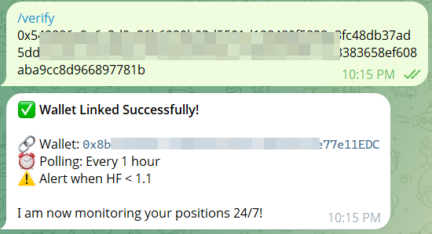
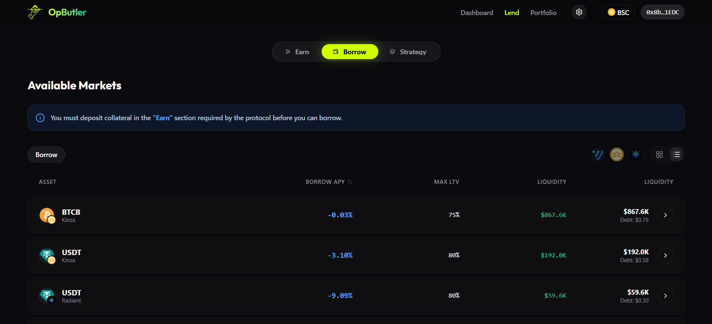

# Technical Architecture & Setup

This guide provides the technical foundation for reproducing the **OpButler** environment.

## 🏗️ Technical Architecture

OpButler is built on a distributed agentic stack:

1.  **Frontend (Next.js 14)**: The primary interaction layer. It uses `wagmi` for secure on-chain connectivity and `viem` for blazing-fast state reads.
2.  **Agent Logic (Node.js)**: The core "Brain". This service polls the BSC RPC, calculates Health Factors across protocols, and passes data to **Gemini API** for risk synthesis.
3.  **Database (Supabase)**: Stores persistent user preferences and allows for 24/7 alert persistence.
4.  **Smart Contracts (Solidity)**: The `OpLoopVault` verifies and executes leverage/deleverage loops atomically on-chain.

---

## 🚀 Setup & Reproduction

### 1. Database Initialization
Deploy the schema in **[src/supabase/migrations.sql](../src/supabase/migrations.sql)**.
This establishes the foundation for user state and alert thresholds.

### 2. AI Risk Agent Configuration
Navigate to `src/telegramagent`, install dependencies, and configure your secrets (`.env.example` -> `.env`).
```bash
cd src/telegramagent
npm install
npm start
```


### 3. Dashboard Connectivity
Navigate to `src/frontend`, install dependencies, and start the development server.
```bash
cd src/frontend
npm install
npm run dev
```

---

## 🧪 Verification & Demo Guide

### Step 1: Link your Wallet
Go to Settings on the Dashboard and input your Telegram ID to bind your chain identity.


### Step 2: Verify on Telegram
Use the `/verify` command to securely handshake your wallet with the Agent.


### Step 3: Execution & Lending
Navigate to the **Lend** page to execute supply/borrow interactions or enter a "Smart Loop".


### Step 4: System Status Check
Run `/status` to verify the Agent is actively polling the RPC and monitoring your health factor.


---

## 📦 Deployment Matrix
- **Frontend**: Vercel (Auto-deployed via GitHub).
- **Agent**: Node.js/PM2 (Railway or VPS).
- **Database**: Supabase (Cloud).
- **Contracts**: BSC Mainnet (`OpLoopVaultV3`).
