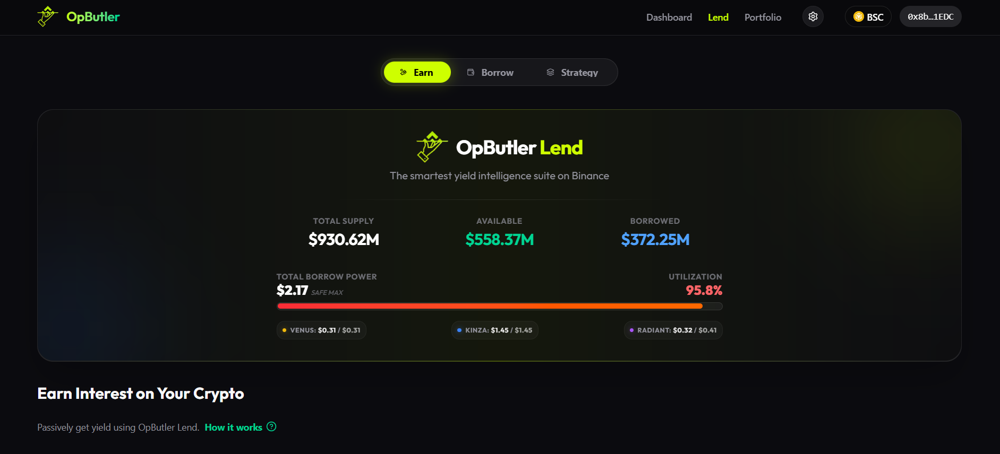

# OpButler Frontend Interface

The "Concierge" interface is built for speed, clarity, and "Good Vibes".

## ✨ Feature Gallery

### 1. Unified Portfolio
Aggregates your Net Worth and Health Factor across all integrated protocols (Venus, Kinza, Radiant).


### 2. High-Yield Lending
Simplified Supply and Borrow interfaces for maximum usability.




### 3. Strategy Executor (Smart Loops)
Our "Smart Loop" builder doesn't just simulate; it **executes**. Architect complex loop strategies, project APY, and optimize for the best possible yields on-chain.


---

## 🛠️ Reproduction Instructions

### 1. Install Dependencies
```bash
npm install
```

### 2. Configure Environment
Create a `.env.local` based on `.env.example`:
- `NEXT_PUBLIC_WALLET_CONNECT_PROJECT_ID`: Get from [WalletConnect Cloud](https://cloud.walletconnect.com/).
- `GEMINI_API_KEY`: Required for frontend AI-insight synthesis.

### 3. Development Server
```bash
npm run dev
```

## 🏗️ Technical Stack

-   **Framework**: [Next.js 14](https://nextjs.org/) (App Router)
-   **Language**: [TypeScript](https://www.typescriptlang.org/)
-   **Styling**: [Tailwind CSS](https://tailwindcss.com/) & [shadcn/ui](https://ui.shadcn.com/)
-   **State Management**: [Zustand](https://github.com/pmndrs/zustand)
-   **Blockchain**: [Wagmi](https://wagmi.sh/) & [Viem](https://viem.sh/)
-   **AI Integration**: [Google Gemini 1.5 Flash](https://deepmind.google/technologies/gemini/flash/)
-   **Data**: [Supabase](https://supabase.com/)

## 📂 Project Structure

```text
src/
├── app/                  # Next.js App Router pages
│   ├── dashboard/        # Main user dashboard
│   ├── lend/             # Lending & Strategy interfaces
│   ├── portfolio/        # Detailed asset breakdown
│   └── settings/         # User preferences & Telegram linking
├── components/           # Reusable UI components
│   ├── ui/               # shadcn/ui primitives
│   └── ...               # Feature-specific components
├── lib/                  # Utilities & Configuration
│   ├── pool-config.ts    # Central DeFi protocol config (Venus/Kinza/Radiant)
│   └── gemini.ts         # AI Client setup
└── hooks/                # Custom React hooks (blockchain/data)
```

## 🔑 Environment Variables

| Variable | Description |
| :--- | :--- |
| `NEXT_PUBLIC_WALLET_CONNECT_PROJECT_ID` | Required for RainbowKit/WalletConnect. Get one from [WalletConnect Cloud](https://cloud.walletconnect.com/). |
| `GEMINI_API_KEY` | Google Gemini API Key for generating risk insights. Get one from [Google AI Studio](https://aistudio.google.com/). |
| `NEXT_PUBLIC_SUPABASE_URL` | Your Supabase Project URL. |
| `NEXT_PUBLIC_SUPABASE_ANON_KEY` | Your Supabase Anon Key. |

---

## ✅ Complete the Setup

To fully deploy the OpButler ecosystem, ensure you have completed all 4 pillars:

1.  **[Current] Frontend Dashboard**: (You are here) The user interface.
2.  **[Smart Contracts](../contracts/README.md)**: The execution layer.
3.  **[Database Schema](../supabase/README.md)**: SQL migrations for user storage.
4.  **[AI Agent](../telegramagent/README.md)**: The autonomous risk manager.
