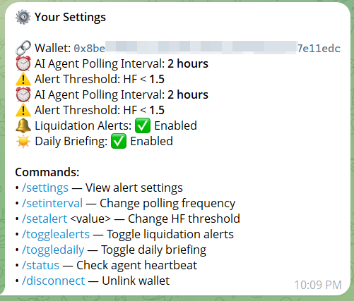

# OpButler AI Risk Agent (Telegram Bot)

Your autonomous watchdog for 24/7 DeFi monitoring.

## 🕹️ Command Showcase

| Start & Onboarding | AI Portfolio Audit | Risk Settings |
| :---: | :---: | :---: |
|  |  |  |

---

## 🚀 Setup & Reproduction

### 1. Secrets Configuration
Create a `.env` file in this directory:
```env
TELEGRAM_BOT_TOKEN=...
SUPABASE_URL=...
SUPABASE_KEY=...
GEMINI_API_KEY=...
RPC_URL=https://bsc-dataseed.binance.org/
```

### 2. installation
```bash
npm install
npm run build
```

### 3. Run the Agent
```bash
npm start
```

## 🛠️ Bot Commands Reference

-   **/start**: Initial greeting and dashboard link.
-   **/verify <sig>**: Securely link your wallet address.
-   **/analyze**: Generate a Gemini-powered risk report for your portfolio.
-   **/settings**: View threshold and polling frequency.
-   **/help**: Detailed list of agent capabilities.
    

## 📡 Backend Specifications
-   **Runtime**: Node.js
-   **Framework**: Grammy.js
-   **Data Storage**: Supabase PostgREST
-   **Risk Logic**: Threshold-based polling with LLM-narrative synthesis.

---

## ✅ Complete the Setup

To fully deploy the OpButler ecosystem, ensure you have completed all three pillars:

1.  **[Current] AI Risk Agent**: (You are here) The 24/7 monitoring backend.
2.  **[Database Schema](../supabase/README.md)**: SQL migrations for user storage.
3.  **[Frontend Dashboard](../frontend/README.md)**: The main user interface.
